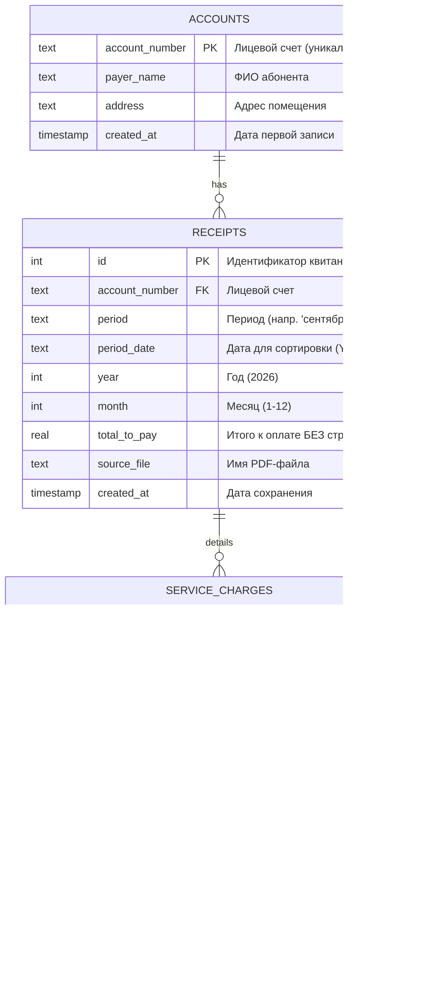

# PDF Table Parser & Analytics (ЕПД МосОблЕИРЦ)

Проект для автоматизированного парсинга, оцифровки и аналитики квитанций Единого платежного документа (ЕПД) ЖКХ МосОблЕИРЦ из формата PDF в реляционную базу данных SQLite с последующей визуализацией данных.

---

## 📌 Основные возможности

- **Автоматический парсинг PDF-квитанций:**
  - Точное извлечение таблиц с адаптивной калибровкой вертикальных разделителей (поддержка квитанций как без блока «Перерасчеты», так и с дополнительной колонкой перерасчетов).
  - Извлечение ключевых метаданных документа: лицевой счет (основной идентификатор), период (месяц/год), ФИО плательщика, адрес, итоговая сумма к оплате.
  - Извлечение детальных начислений по услугам: категория (жилищные, коммунальные, иные), наименование услуги, объем, единица измерения, тариф, начислено по тарифу, перерасчет, задолженность/переплата, оплачено, итого.
  - Автоматическая фильтрация добровольного страхования (сумма к оплате сохраняется строго без учета страхования).

- **Надежное хранение в SQLite:**
  - Нормализованная реляционная схема (`accounts` ➔ `receipts` ➔ `service_charges`).
  - Гарантированная защита от дублирования записей (`UNIQUE(account_number, year, month)`).
  - Идемпотентность: повторный запуск для уже загруженного месяца аккуратно обновляет данные квитанции без создания дубликатов.
  - Каскадное удаление (`ON DELETE CASCADE`) и индексы для быстрых аналитических выборок.

- **Аналитика и визуализация:**
  - Готовый Jupyter Notebook с примерами SQL-запросов и графиков (динамика платежей, сезонность отопления, потребление ресурсов, топ затратных услуг).

---

## 🗂 Структура проекта

```text
pdf_table_parcer/
├── data/
│   └── pdf/                     # Директория для входящих PDF-квитанций
├── db/
│   └── receipts.db              # База данных SQLite (создается автоматически)
├── notebooks/
│   └── receipts_analytics.ipynb # Jupyter Notebook с примерами запросов и графиков
├── logs/                        # Логи работы приложения
├── requirements/
│   └── dev.txt                  # Зависимости проекта
├── settings/
│   └── settings.ini             # Локальный конфигурационный файл
├── src/
│   ├── classes/
│   │   ├── base.py              # Базовый класс логирования и обработки
│   │   ├── receipt_parser.py    # Парсер квитанций на базе pdfplumber
│   │   └── error_classes.py     # Пользовательские исключения
│   ├── common/                  # Утилиты логирования и константы
│   ├── config/                  # Загрузка и валидация конфигурации
│   └── db/
│       └── database.py          # Менеджер SQLite (схема, транзакции, запросы)
├── main.py                      # Точка входа для запуска парсинга
└── README.md
```

---

## 🗄 Схема базы данных



---

## 🚀 Установка и запуск

### 1. Подготовка окружения
Клонируйте проект или перейдите в его директорию, затем активируйте виртуальное окружение:

```bash
# Windows PowerShell
.\.venv\Scripts\Activate.ps1
```

Установите необходимые зависимости:

```bash
pip install -r requirements/dev.txt
```

> **Основные зависимости:** `pdfplumber` (парсинг PDF), `pandas` и `matplotlib` (аналитика и графики в ноутбуке).

### 2. Конфигурация
Параметры директорий настраиваются в файле `settings/settings.ini`:

```ini
[WORKSPACE]
main_dir = D:\PyProjects\_my\pdf_table_parcer
log_dir_name = D:\PyProjects\_my\pdf_table_parcer\logs
pdf_dir = D:\PyProjects\_my\pdf_table_parcer\data\pdf

[DB_CONNECT]
db_path = D:\PyProjects\_my\pdf_table_parcer\db\receipts.db
```

### 3. Запуск оцифровки
Поместите PDF-файлы квитанций в директорию `data/pdf/` и выполните:

```bash
python main.py
```

Скрипт выполнит:
1. Поиск всех `*.pdf` файлов в папке `data/pdf/`.
2. Извлечение таблиц начислений и реквизитов.
3. Сохранение данных в `db/receipts.db`.
4. Вывод сводной статистики обработки в консоль и лог-файл в папке `logs/`.

---

## 📊 Аналитика и визуализация

Для интерактивного анализа данных откройте файл:
`notebooks/receipts_analytics.ipynb`

### Примеры аналитических запросов:

#### 1. Динамика суммы к оплате по месяцам
```sql
SELECT period_date, period, total_to_pay 
FROM receipts 
WHERE account_number = '32546-580' 
ORDER BY period_date;
```

#### 2. Сезонное потребление отопления (Гкал и начисления)
```sql
SELECT r.period_date, sc.volume, sc.tariff, sc.total_amount
FROM service_charges sc
JOIN receipts r ON sc.receipt_id = r.id
WHERE sc.account_number = '32546-580' AND sc.service_name LIKE '%ОТОПЛЕНИЕ%'
ORDER BY r.period_date;
```

#### 3. Топ-5 самых затратных услуг
```sql
SELECT service_name, ROUND(SUM(total_amount), 2) AS total_sum
FROM service_charges
GROUP BY service_name
ORDER BY total_sum DESC
LIMIT 5;
```

---

## 🛠 Стек технологий

- **Язык:** Python 3.12
- **Извлечение данных из PDF:** `pdfplumber`
- **База данных:** SQLite 3
- **Анализ данных и визуализация:** `pandas`, `matplotlib`, `Jupyter Notebook`
