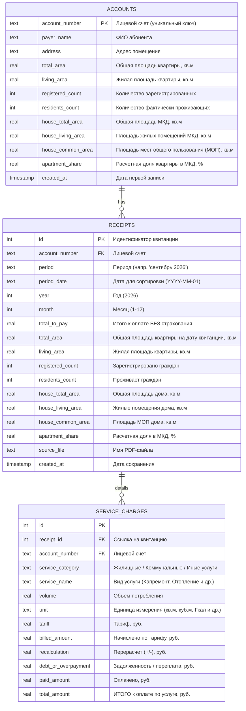

# PDF Table Parser & Analytics (ЕПД МосОблЕИРЦ)

Проект для автоматизированного парсинга, оцифровки и аналитики квитанций Единого платежного документа (ЕПД) ЖКХ МосОблЕИРЦ из формата PDF в реляционную базу данных SQLite с последующей интерактивной визуализацией данных.

---

## 📌 Основные возможности

- **Автоматический парсинг PDF-квитанций:**
  - Точное извлечение таблиц с адаптивной калибровкой вертикальных разделителей (поддержка квитанций как без блока «Перерасчеты», так и с дополнительной колонкой перерасчетов).
  - Извлечение ключевых метаданных документа: лицевой счет (основной идентификатор), период (месяц/год), ФИО плательщика, адрес, характеристики жилья и МКД (общая и жилая площадь квартиры, количество проживающих/зарегистрированных, общая площадь дома, площадь жилых помещений дома, площадь МОП, расчетная доля в МКД), итоговая сумма к оплате.
  - Извлечение детальных начислений по услугам: категория (жилищные, коммунальные, иные), наименование услуги, объем, единица измерения, тариф, начислено по тарифу, перерасчет, задолженность/переплата, оплачено, итого.
  - Автоматическая фильтрация добровольного страхования (сумма к оплате сохраняется строго без учета страхования).

- **Надежное хранение в SQLite:**
  - Нормализованная реляционная схема (`accounts` ➔ `receipts` ➔ `service_charges`).
  - Гарантированная защита от дублирования записей (`UNIQUE(account_number, year, month)`).
  - Идемпотентность: повторный запуск для уже загруженного месяца аккуратно обновляет данные квитанции без создания дубликатов.
  - Каскадное удаление (`ON DELETE CASCADE`) и индексы для быстрых аналитических выборок.

- **Интерактивная аналитика и визуализация на Plotly:**
  - Готовый интерактивный Jupyter Notebook на базе **Plotly** с всплывающими подсказками (tooltips), масштабированием (zoom/pan), фильтрацией в легенде и 13 аналитическими разделами:
    - Реестр лицевых счетов и квитанций.
    - Помесячная динамика платежей и сезонность отопления.
    - Потребление ресурсов в физических величинах (электроэнергия, водоотведение).
    - Рейтинги самых затратных услуг за все время и по годам (с процентными долями).
    - Распределение категорий услуг в разрезе годов (абсолютные и 100% нормированные доли).
    - Годовая динамика Year-over-Year (сезонные кривые месяц к месяцу и диаграмма прироста/экономии).
    - Анализ индексации тарифов (Tariff Tracker: прирост ставок и нормированный индекс цен).
    - Факторный анализ «Тариф vs Объем» (декомпозиция: вклад потребления vs вклад индексации цен).
    - Интерактивный селектор услуг (`ipywidgets` Dropdown).
    - Журнал перерасчетов (ОДН и корректировки).

---

## 🗂 Структура проекта

```text
pdf_table_parcer/
├── data/
│   └── pdf/                     # Директория для входящих PDF-квитанций
├── db/
│   └── receipts.db              # База данных SQLite (создается автоматически)
├── notebooks/
│   └── receipts_analytics.ipynb # Jupyter Notebook с примерами запросов и графиков
├── logs/                        # Логи работы приложения
├── requirements/
│   └── dev.txt                  # Зависимости проекта
├── settings/
│   └── settings.ini             # Локальный конфигурационный файл
├── src/
│   ├── classes/
│   │   ├── base.py              # Базовый класс логирования и обработки
│   │   ├── receipt_parser.py    # Парсер квитанций на базе pdfplumber
│   │   └── error_classes.py     # Пользовательские исключения
│   ├── common/                  # Утилиты логирования и константы
│   ├── config/                  # Загрузка и валидация конфигурации
│   └── db/
│       └── database.py          # Менеджер SQLite (схема, транзакции, запросы)
├── main.py                      # Точка входа для запуска парсинга
└── README.md
```

---

## 🗄 Схема базы данных



---

## 🚀 Установка и запуск

### 1. Подготовка окружения
Клонируйте проект или перейдите в его директорию, затем активируйте виртуальное окружение:

```bash
# Windows PowerShell
.\.venv\Scripts\Activate.ps1
```

Установите необходимые зависимости:

```bash
pip install -r requirements/dev.txt
```

> **Основные зависимости:** `pdfplumber` (парсинг PDF), `pandas` (обработка данных), `plotly` и `nbformat` (интерактивные графики с всплывающими подсказками), `matplotlib` (статический fallback), `ipywidgets` (интерактивные селекторы).

### 2. Конфигурация
Параметры директорий настраиваются в файле `settings/settings.ini`:

```ini
[WORKSPACE]
main_dir = D:\PyProjects\_my\pdf_table_parcer
log_dir_name = D:\PyProjects\_my\pdf_table_parcer\logs
pdf_dir = D:\PyProjects\_my\pdf_table_parcer\data\pdf

[DB_CONNECT]
db_path = D:\PyProjects\_my\pdf_table_parcer\db\receipts.db
```

### 3. Запуск оцифровки
Поместите PDF-файлы квитанций в директорию `data/pdf/` и выполните:

```bash
python main.py
```

Скрипт выполнит:
1. Поиск всех `*.pdf` файлов в папке `data/pdf/`.
2. Извлечение таблиц начислений и реквизитов.
3. Сохранение данных в `db/receipts.db`.
4. Вывод сводной статистики обработки в консоль и лог-файл в папке `logs/`.

---

## 📊 Аналитика и визуализация

Для интерактивного анализа данных откройте файл:
[`notebooks/receipts_analytics.ipynb`](file:///D:/PyProjects/_my/pdf_table_parcer/notebooks/receipts_analytics.ipynb)

Все графики реализованы на **Plotly** с поддержкой:
- **Интерактивных подсказок (Tooltips / Hover):** при наведении курсора отображаются точные рублевые суммы, проценты, объемы и тарифы;
- **Масштабирования (Zoom & Pan):** возможность детального приближения любого диапазона месяцев;
- **Умной легенды:** клик по названию услуги или категории изолирует или скрывает соответствующую линию/сегмент.

Ниже приведены подробные описания визуализаций и соответствующие SQL-запросы для каждого из 13 аналитических разделов:

---

### 1. Лицевой счет и реестр загруженных квитанций
- **Что представляет раздел:** Табличный паспорт абонента и объекта недвижимости (общая и жилая площадь квартиры, характеристики МКД, зарегистрировано/проживает, доля в МКД) и хронологический реестр оцифрованных квитанций с автоматическим расчетом удельной стоимости ЖКУ на 1 кв.м общей площади (`cost_per_sqm`, ₽/м²). Позволяет проверить корректность привязки лицевого счета, адрес помещения, перечень обработанных файлов, дату периода и итоговые суммы без добровольного страхования.
- **SQL-запрос:**
```sql
-- Паспорт абонента и характеристики жилья
SELECT account_number, payer_name, address, 
       total_area, living_area, registered_count, residents_count,
       house_total_area, house_living_area, house_common_area, apartment_share,
       created_at 
FROM accounts;

-- Реестр квитанций с расчетом удельной стоимости 1 кв.м
SELECT id, period, period_date, total_to_pay, total_area,
       ROUND(total_to_pay / NULLIF(total_area, 0), 2) AS cost_per_sqm,
       apartment_share, source_file 
FROM receipts 
WHERE account_number = '32546-580'
ORDER BY period_date;
```

---

### 2. Динамика общей суммы начислений по месяцам
- **Что представляет график:** Интерактивная столбчатая диаграмма Plotly (Bar Chart), отображающая итоговую сумму платежа по квитанции за каждый месяц (без учета добровольного страхования) в сопоставлении с удельной стоимостью 1 кв.м жилья (`cost_per_sqm`, ₽/м²).
  - **Оси:** Ось $X$ упорядочена строго хронологически по дате (`YYYY-MM-01`) с подписями месяцев («январь 2026», «февраль 2026»...); ось $Y$ показывает сумму к оплате в рублях.
  - **Интерактивные элементы:** Подсказка при наведении показывает точную сумму с форматированием рублей и удельную ставку на 1 кв.м (`17 649.33 ₽ (259.17 ₽/м²)`), над столбцами выведены статические метки значений.
  - **Аналитическая ценность:** Позволяет визуально отслеживать общую финансовую нагрузку домохозяйства и мгновенно выявлять месяцы сезонных всплесков затрат, сопоставляя нагрузку с квадратным метром жилплощади.
- **SQL-запрос:**
```sql
SELECT period_date, period, total_to_pay,
       ROUND(total_to_pay / NULLIF(total_area, 0), 2) AS cost_per_sqm
FROM receipts 
WHERE account_number = '32546-580' 
ORDER BY period_date;
```

---

### 3. Распределение начислений по категориям услуг (за все время)
- **Что представляет график:** Интерактивная кольцевая диаграмма Plotly (Donut Chart) с процентными долями укрупненных категорий (*Коммунальные услуги*, *Жилищные услуги*, *Иные услуги*) за весь период наблюдений.
  - **Интерактивные элементы:** При наведении отображается название категории, сумма в рублях и точная процентная доля. Ключевой сегмент («Коммунальные услуги») выдвинут (`pull`), внизу расположена интерактивная легенда.
  - **Аналитическая ценность:** Демонстрирует макроструктуру расходов на жилье: какую часть бюджета занимают ресурсоемкие коммунальные услуги (отопление, вода, электричество), какую — содержание жилья и фиксированные взносы.
- **SQL-запрос:**
```sql
SELECT service_category, ROUND(SUM(total_amount), 2) AS category_sum
FROM service_charges
GROUP BY service_category
ORDER BY category_sum DESC;
```

---

### 4. Сезонный анализ отопления (расход и начисления)
- **Что представляет график:** Двухосевой комбинированный график Plotly (Dual Axis Bar + Line Chart):
  - **Левая ось $Y$ (красные столбцы):** Сумма начислений за отопление в рублях по каждому месяцу.
  - **Правая ось $Y$ (темная линия с маркерами):** Фактический физический объем потребленного тепла в гигакалориях (Гкал).
  - **Интерактивные подсказки:** Единый тултип (`x unified`) сопоставляет рубли и Гкал в одной точке времени при наведении курсора.
  - **Аналитическая ценность:** Наглядно иллюстрирует влияние отопительного сезона: спад потребления тепла до нуля в теплое время года (с мая по сентябрь) и резкий скачок затрат в зимние месяцы (ноябрь – март).
- **SQL-запрос:**
```sql
SELECT r.period, r.period_date, sc.volume, sc.tariff, sc.total_amount
FROM service_charges sc
JOIN receipts r ON sc.receipt_id = r.id
WHERE sc.service_name LIKE '%ОТОПЛЕНИЕ%'
ORDER BY r.period_date;
```

---

### 5. Динамика расхода электроэнергии и водоотведения
- **Что представляет график:** Линейный график Plotly с двумя независимыми вертикальными шкалами (`secondary_y`), отображающий физические объемы потребления ресурсов:
  - **Левая ось $Y$ (синяя линия с маркерами):** Водоотведение в кубических метрах ($\text{м}^3$), диапазон значений 10–25 $\text{м}^3$.
  - **Правая ось $Y$ (оранжевая линия с маркерами):** Электроэнергия в киловатт-часах ($\text{кВт}\cdot\text{ч}$), диапазон значений 130–270 $\text{кВт}\cdot\text{ч}$.
  - **Интерактивность:** При наведении курсора выводится точный расход каждого ресурса. Независимые шкалы исключают эффект сплющивания графика воды.
  - **Аналитическая ценность:** Независимый трекинг физического расхода ресурсов жильцами без искажений масштабов.
- **SQL-запрос:**
```sql
SELECT r.period_date, r.period, sc.service_name, sc.volume, sc.unit
FROM service_charges sc
JOIN receipts r ON sc.receipt_id = r.id
WHERE sc.service_name LIKE '%ЭЛЕКТРИЧЕСТВО%' OR sc.service_name = 'ВОДООТВЕДЕНИЕ'
ORDER BY r.period_date;
```

---

### 6. Топ-10 самых затратных услуг за весь период
- **Что представляет график:** Горизонтальная столбчатая диаграмма Plotly (Horizontal Bar Chart), ранжирующая все услуги квитанции по убыванию накопленной суммы затрат за все месяцы.
  - **Интерактивные элементы:** Подсказка при наведении с полным названием услуги и точной суммой начислений в рублях.
  - **Аналитическая ценность:** Выявляет ключевые статьи совокупных затрат за длительный период, определяя фокус для потенциальной экономии ресурсов.
- **SQL-запрос:**
```sql
SELECT service_name, ROUND(SUM(total_amount), 2) AS total_sum
FROM service_charges
GROUP BY service_name
ORDER BY total_sum DESC
LIMIT 10;
```

---

### 7. Сведения о перерасчетах (ОДН и корректировки)
- **Что представляет раздел:** Выборка и детальная таблица всех услуг, по которым в квитанциях зафиксированы суммы в столбце «Перерасчет» (`recalculation != 0`).
  - **Содержимое:** Название услуги, период, сумма корректировки (+/- в рублях) и итоговая сумма к оплате.
  - **Аналитическая ценность:** Позволяет контролировать доначисления и возвраты платы за коммунальные ресурсы на содержание общего имущества (КР СОИ / ОДН) в рамках Постановления Правительства РФ № 491.
- **SQL-запрос:**
```sql
SELECT r.period, sc.service_name, sc.recalculation, sc.total_amount
FROM service_charges sc
JOIN receipts r ON sc.receipt_id = r.id
WHERE ABS(sc.recalculation) > 0.01
ORDER BY r.period_date, sc.service_name;
```

---

### 8. Топ-3 самых затратных услуг в разрезе каждого года
- **Что представляет график:** Многопанельная горизонтальная столбчатая диаграмма Plotly (Subplots по каждому году):
  - **Интерактивные элементы:** Каждый год представлен отдельной панелью. Подсказка при наведении раскрывает позицию в рейтинге, точную сумму в рублях и **процентную долю услуги в годовом бюджете ЖКУ** (например, `Отопление: 38 625 ₽ (23.3%)`).
  - **Аналитическая ценность:** Наглядно показывает, меняется ли состав ключевых драйверов расходов от года к году и насколько стабильны доли отопления, содержания жилого фонда и электроэнергии.
- **SQL-запрос:**
```sql
WITH year_totals AS (
    SELECT year, SUM(total_amount) AS year_sum
    FROM service_charges sc
    JOIN receipts r ON sc.receipt_id = r.id
    GROUP BY year
),
ranked_services AS (
    SELECT 
        r.year,
        sc.service_name,
        ROUND(SUM(sc.total_amount), 2) AS total_sum,
        ROUND(SUM(sc.total_amount) * 100.0 / yt.year_sum, 1) AS share_percent,
        ROW_NUMBER() OVER (PARTITION BY r.year ORDER BY SUM(sc.total_amount) DESC) AS rank
    FROM service_charges sc
    JOIN receipts r ON sc.receipt_id = r.id
    JOIN year_totals yt ON r.year = yt.year
    GROUP BY r.year, sc.service_name
)
SELECT year, rank, service_name, total_sum, share_percent
FROM ranked_services
WHERE rank <= 3
ORDER BY year, rank;
```

---

### 9. Распределение начислений по категориям услуг в разрезе годов
- **Что представляет график:** Сдвоенная визуальная панель Plotly (1 ряд, 2 графика):
  1. **Слева — Группированные столбцы (Grouped Bar Chart):** Кластеры столбцов по категориям (*Коммунальные*, *Жилищные*, *Иные*) для каждого года с подсказками сумм в рублях.
  2. **Справа — 100% Накопительная столбчатая диаграмма (100% Stacked Bar Chart):** Нормированная структура долей (0–100%) по годам с процентами внутри сегментов.
  - **Аналитическая ценность:** Позволяет одновременно отслеживать как абсолютный рост трат по каждой категории, так и изменение их пропорционального веса в семейном бюджете.
- **SQL-запрос:**
```sql
WITH year_totals AS (
    SELECT year, SUM(total_amount) AS total_year
    FROM service_charges sc
    JOIN receipts r ON sc.receipt_id = r.id
    GROUP BY year
)
SELECT 
    r.year AS 'Год',
    sc.service_category AS 'Категория',
    ROUND(SUM(sc.total_amount), 2) AS 'Сумма, руб.',
    ROUND(SUM(sc.total_amount) * 100.0 / yt.total_year, 1) AS 'Доля, %'
FROM service_charges sc
JOIN receipts r ON sc.receipt_id = r.id
JOIN year_totals yt ON r.year = yt.year
GROUP BY r.year, sc.service_category
ORDER BY r.year, SUM(sc.total_amount) DESC;
```

---

### 10. Годовая динамика начислений (Year-over-Year / YoY)
- **Что представляет график:** Двухуровневый аналитический дашборд Plotly (2 ряда, 1 колонка, единая ось месяцев 1–12):
  1. **Сверху — Сезонные кривые (Seasonal Line Chart):** Линейные графики платежей за каждый месяц для 2025 и 2026 годов. При наведении на месяц выводятся суммы для обоих лет.
  2. **Снизу — Дельта год к году (YoY Delta Bar Chart):** Столбчатая диаграмма чистой разницы расходов ($S_{2026} - S_{2025}$) с условной цветовой кодировкой:
     - **Красные столбцы:** Удорожание платежа (рост расходов).
     - **Зеленые столбцы:** Снижение платежа (экономия).
     - Подсказка показывает точную сумму в рублях и относительное изменение в процентах (`+4 955 ₽ (+31.7%)`).
  - **Дополнительно:** Сводная таблица среднего чека за месяц по годам.
  - **Аналитическая ценность:** Наглядно показывает инфляцию расходов на ЖКУ в одинаковые календарные месяцы разных лет.
- **SQL-запрос:**
```sql
SELECT month, year, total_to_pay
FROM receipts
ORDER BY month, year;
```

---

### 11. Анализ индексации тарифов (Tariff Tracker)
- **Что представляет график:** Мультилинейный интерактивный график Plotly нормализованного индекса тарифов (базовый период = 100%):
  - **Оси:** Ось $X$ — хронология месяцев; ось $Y$ — индекс изменения тарифа в процентах.
  - **Интерактивные линии:** Траектории ключевых услуг (*Взнос на капремонт, Содержание жилфонда, Электричество, Отопление, Водоотведение, Домофон, Обращение с ТКО*). При наведении на любую точку всплывает подсказка с индексом в % и точной ставкой тарифа в рублях.
  - **Фильтрация по клику:** Кликнув по названию услуги в легенде, можно мгновенно скрыть её или оставить только выбранную услугу (двойной клик).
  - **Дополнительно:** Таблица тарифов с начальной и текущей ставкой, абсолютной разницей ($\Delta T$, руб.) и процентным приростом ($\Delta T_{\%}$).
  - **Аналитическая ценность:** Нормализация к 100% устраняет несопоставимость единиц измерения и позволяет наглядно отслеживать календарные даты и процент индексации тарифов.
- **SQL-запрос:**
```sql
SELECT 
    r.period_date,
    r.period,
    sc.service_name,
    sc.unit,
    sc.tariff
FROM service_charges sc
JOIN receipts r ON sc.receipt_id = r.id
WHERE sc.tariff > 0
ORDER BY r.period_date;
```

---

### 12. Факторный анализ: «Тариф vs Объем» (Price-Volume Effect)
- **Что представляет график:** Двухфакторная парная горизонтальная столбчатая диаграмма Plotly декомпозиции изменений начислений между сопоставимыми периодами (например, Сентябрь 2025 vs Сентябрь 2026):
  - **Синий столбец — Фактор объема (расход ресурса):**  
    $$\Delta C_{vol} = (V_1 - V_0) \times T_0$$  
    Вклад изменения объема потребления в рублях при фиксированном базовом тарифе. Тултип раскрывает расход базового и текущего года.
  - **Оранжевый столбец — Фактор тарифа (индексация цен):**  
    $$\Delta C_{price} = V_1 \times (T_1 - T_0)$$  
    Вклад изменения ставки тарифа в рублях при новом фактическом объеме. Тултип показывает старый и новый тариф.
  - **Аналитическая ценность:** Дает математически строгое объяснение, чем обусловлен рост или снижение счета: изменился ли собственный объем потребления или повлияло подорожание услуг со стороны поставщиков.
- **SQL-запрос:**
```sql
SELECT 
    sc.service_name,
    MAX(CASE WHEN r.year = 2025 THEN sc.volume END) AS v0,
    MAX(CASE WHEN r.year = 2025 THEN sc.tariff END) AS t0,
    MAX(CASE WHEN r.year = 2025 THEN sc.billed_amount END) AS b0,
    MAX(CASE WHEN r.year = 2026 THEN sc.volume END) AS v1,
    MAX(CASE WHEN r.year = 2026 THEN sc.tariff END) AS t1,
    MAX(CASE WHEN r.year = 2026 THEN sc.billed_amount END) AS b1
FROM service_charges sc
JOIN receipts r ON sc.receipt_id = r.id
WHERE r.month = 9
GROUP BY sc.service_name
HAVING b0 IS NOT NULL AND b1 IS NOT NULL AND (b0 > 0 OR b1 > 0)
ORDER BY b1 DESC;
```

---

### 13. Интерактивный селектор услуг (ipywidgets Dropdown + Plotly)
- **Что представляет график:** Интерактивный аналитический дашборд с выпадающим списком (`Dropdown`) всех услуг квитанции, отрисовываемый в Plotly:
  - **Верхний график (Dual Y-Axis):** Синяя линия с маркерами отображает расход ресурса в физических единицах (кВт·ч, куб.м, Гкал, кв.м), а красная линия показывает начисленную сумму в рублях по правой шкале $Y$ с детальными тултипами.
  - **Нижний график (Step Line):** Зеленая ступенчатая линия Plotly (`shape="hv"`) динамики утвержденной тарифной ставки с точками фиксации изменений во времени.
  - **Аналитическая ценность:** Позволяет в один клик получить интерактивную историю потребления, начислений и тарифов по абсолютно любой услуге.
- **SQL-запрос:**
```sql
SELECT 
    r.period_date,
    r.period,
    sc.service_name,
    sc.volume,
    sc.unit,
    sc.tariff,
    sc.billed_amount,
    sc.total_amount
FROM service_charges sc
JOIN receipts r ON sc.receipt_id = r.id
ORDER BY r.period_date;
```

---

## 🛠 Стек технологий

- **Язык:** Python 3.12
- **Извлечение данных из PDF:** `pdfplumber`
- **База данных:** SQLite 3
- **Анализ данных и интерактивная визуализация:** `pandas`, `plotly`, `matplotlib`, `ipywidgets`, `Jupyter Notebook`
